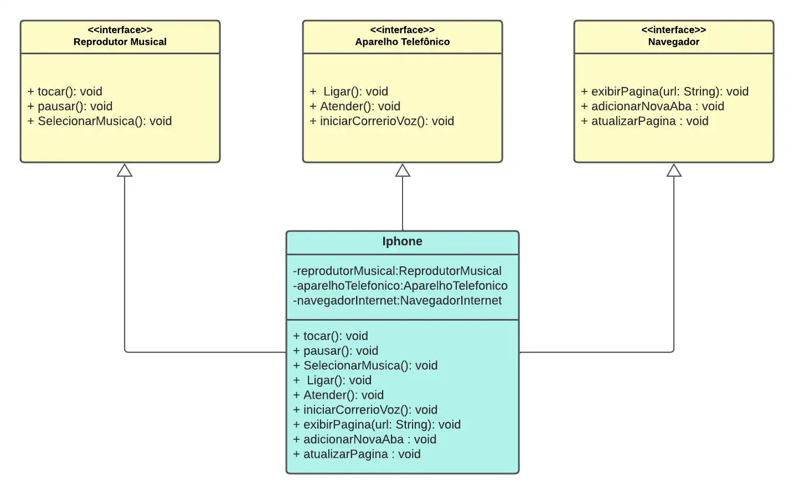

# Trilha Java Básico [Desafio DIO](https://github.com/digitalinnovationone/trilha-java-basico/tree/main/desafios/poo) 

### Solução




Código:

interfaces
```java
package interfaces;

public interface AparelhoTelefonico {
    public void ligar(String cell);
    public void atender();
    public void iniciarCorreioVoz();
}

```
```java
package interfaces;

public interface NavegadorInternet {
    public void exibirPagina();
    public void adicionarNovaAba();
    public void atualizarPagina();
}

```
```java
package interfaces;

public interface ReprodutorMusicial {
    public void tocar(String musica);
    public void pausar();
    public void selecionarMusica();
}

```

models
```java
package models;

import interfaces.AparelhoTelefonico;
import interfaces.NavegadorInternet;
import interfaces.ReprodutorMusicial;

public class Iphone implements AparelhoTelefonico, NavegadorInternet, ReprodutorMusicial {
    @Override
    public void ligar(String cell) {
        System.out.println("ligando para " + cell);
    }

    @Override
    public void atender() {
        System.out.println("Atendendo a ligação!");
    }

    @Override
    public void iniciarCorreioVoz() {
        System.out.println("Reproduzindo correio de voz");
    }

    @Override
    public void exibirPagina() {
        System.out.println("Exibindo página");
    }

    @Override
    public void adicionarNovaAba() {
        System.out.println("Nova aba!");
    }

    @Override
    public void atualizarPagina() {
        System.out.println("Página atualizada!");
    }

    @Override
    public void tocar(String musica) {

        System.out.println("Tocando " + musica);
    }

    @Override
    public void pausar() {
        System.out.println("Musica pausada!");
    }

    @Override
    public void selecionarMusica() {
        System.out.println("Musica selecionada!");
    }
}

```

Main
```java
public class Main {
    public static void main(String[] args) {
        System.out.println("Hello world!");
    }
}
```
